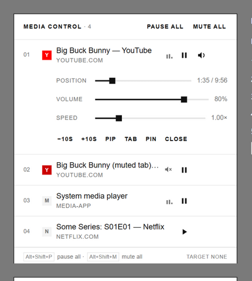
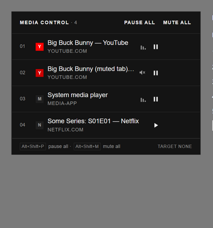

# Media Control Panel

A Swiss-minimal Chrome extension that puts every tab playing media into one toolbar popup —
Chrome's own Global Media Controls, but stronger: pause everything, mute everything, seek, per-tab
volume and speed, Picture-in-Picture, and a keyboard command surface. Built as pure HTML/CSS/JS:
no framework, no build step, no webfonts, nothing to compile.

Everything is local: no accounts, no analytics, no network requests. The only state is the pinned
target and the recently-playing list in `chrome.storage.session` (cleared when the browser closes).

| Light | Dark |
|---|---|
|  |  |

## Features (v2.0)

- **One row per media tab** — sounding tabs, muted tabs, and recently-playing tabs show up with
  favicon, media title (from the page's media session when available), hostname and live playback
  state. Cross-origin iframes and open shadow roots are covered.
- **Row controls** — play/pause and tab mute on every row; clicking the title switches to the tab.
- **Expanded panel** — seek bar with times (or a LIVE tag on streams), ±10 s, element volume,
  playback speed 0.25×–4×, Picture-in-Picture toggle, switch to tab, pin as target, close tab.
- **Pause all / Mute all** in the header; Mute all flips to Unmute all contextually.
- **Pinned target** — mark one tab (red index) and toggle its playback from the keyboard without
  opening the popup.
- **Keyboard commands** (remappable at `chrome://extensions/shortcuts`):
  - `Alt+Shift+Space` — play/pause the pinned target
  - `Alt+Shift+P` — pause media in every tab that has any
  - `Alt+Shift+M` — mute all audible tabs / unmute what this extension muted
- **Playing-count badge** — the toolbar icon shows how many tabs are making sound, like Chrome's
  own media icon.
- **Dark mode** — follows the system, token swap only.

## Install (unpacked)

1. Open `chrome://extensions`, enable **Developer mode**, click **Load unpacked**, select the
   `extension/` folder.
2. Click the toolbar icon. For private windows also enable **Allow in Incognito** on the
   extension card.
3. Optional: `npm run icons` regenerates the icon set (pure Node, no dependencies).

## Try it

`npm run serve`, open <http://localhost:8080/test/media-page.html> (two remote videos, a local
tone, a remote mp3 and a cross-origin YouTube embed), then open the popup. For the UI without
Chrome at all: <http://localhost:8080/test/popup-mock.html> runs the real popup against a mock
browser; <http://localhost:8080/test/background-mock.html> asserts the full command matrix.

`npm test` runs static checks (module syntax, manifest sanity, icons, references, and a guard
that injected functions stay serialization-safe).

## Why it's light

There are **no persistent content scripts**. While the popup is closed the extension is two
sleeping event listeners (badge + keyboard commands); the service worker goes dormant after 30
idle seconds like any MV3 worker. Detection uses `tabs.query` (audible/muted need no permission),
control is on-demand `chrome.scripting.executeScript` only when you click something, and the seek
bar's 1-second refresh runs only while a row is expanded **and** playing. Total unpacked size is
under 25 KB including icons.

Permissions, exactly:

| Permission | Why |
|---|---|
| `scripting` | inject the control functions into media tabs |
| `storage` | pinned target + recently-playing list (session-scoped) |
| `<all_urls>` (host) | `executeScript` into arbitrary tabs; also unlocks tab titles |

No `tabs` permission (the "read your browsing history" warning) — audible/muted state is free,
and host permissions already unlock titles.

## Design

International Typographic Style: an 8 px grid, hairlines, sharp corners, ink on paper with one
Swiss red accent that only ever marks meaning (the pinned target, live indicators). System
Helvetica stack — zero font downloads. The full token set, component vocabulary (mapped from
shadcn/ui) and interaction specs live in [docs/DESIGN.md](docs/DESIGN.md).

## Architecture

```
extension/
  manifest.json    MV3 — scripting+storage, <all_urls>, 3 commands, no content scripts
  popup.html/css/js  the whole UI; exists only while open
  background.js    badge count + keyboard commands; sleeps otherwise
  lib/page.js      injected functions (probe/ping/toggle/pause/seek/volume/rate/PiP)
scripts/           icon generator + static checks
test/              mock browser, popup harness, background harness, media fixture
docs/              RESEARCH.md (why), DESIGN.md (look), PLAN.md (roadmap)
```

See [docs/RESEARCH.md](docs/RESEARCH.md) for how Chrome's Global Media Controls works, what other
media-control extensions do, and why this one is built the way it is.

## Known limits

- Media inside closed shadow roots, DRM-protected pages and WebAudio-only playback can't be
  reached by any extension in this category (Chrome's internal media session service is not
  exposed to extensions).
- Next/previous track requires per-site adapters; not built (roadmap).
- `chrome://` pages can be listed and muted but not play/paused — they are not injectable.
